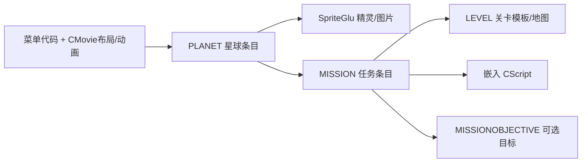

# Gun Bros 数据条目与 Binary Template

范围：当前 `big_360_out` 的 13 个 xga 包，依据 iOS 3.6.0 原读取器定位。
本页区分实体模板、商店条目和界面 Movie；它们共同参与组装，不能用一个 UI bin 代替全部数据。

## 本次方案与验收

按用户已确认的用途制作辅助理解的 010 Editor `.bt`，不要求实际运行。先从原 Init 核对字段，再用原 TOC/Keyset 定位文件，最后只读检查序列化边界。未知语义保留 Raw，不补造字段。

各模板已按原代码的读取、赋值和消费路径补充逐字段注释，包含用途、单位、条件及源码行号。旧 Raw 字段名为便于对应目录而保留，是否已确认请看字段注释；主要发现与未解项见 [字段用途核对](entry-field-semantics.md)。

本页保留第一阶段8类实体/商品的详细样本和33分区索引。后续两小时研究已补其他实体、几何、精灵、字节码及存档；最新完整覆盖见[全资源入口](binary-template-catalog.md)和[存档入口](save-binary-templates.md)。下表‘仅定位’仅指本索引工具，不代表后续没有解析。

## 模板与实际样本

| 数据类型 | 非空条目数 | 本批长度（字节） | 模板 | 实际样本 |
|---|---:|---|---|---|
| ARMOR | 233 | 86 | [armor_template.bt](<../_Big_tool/binary template/big_assets/entries/armor_template.bt>) | [pack0_core_xga / ARMOR[0]](<../big_360_out/pack0_core_xga/0xf4e02223/03_ARMOR/pack0_core_xga_0003_0x55de.bin>) |
| GUN | 76 | 125–1196（53 种） | [gun_template.bt](<../_Big_tool/binary template/big_assets/entries/gun_template.bt>) | [pack0_core_xga / GUN[0]](<../big_360_out/pack0_core_xga/0xf4e02223/07_GUN/pack0_core_xga_0009_0x56fc.bin>) |
| MISSION | 61 | 43, 74, 85, 91 | [mission_entry.bt](<../_Big_tool/binary template/big_assets/entries/mission_entry.bt>) | [pack11_xga / MISSION[0]](<../big_360_out/pack11_xga/0xf4e02223/10_MISSION/pack11_xga_0025_0x28a5.bin>) |
| MISSIONOBJECTIVE | 4 | 21 | [mission_objective_entry.bt](<../_Big_tool/binary template/big_assets/entries/mission_objective_entry.bt>) | [pack7_xga / MISSIONOBJECTIVE[0]](<../big_360_out/pack7_xga/0xf4e02223/11_MISSIONOBJECTIVE/pack7_xga_0026_0x2ffd.bin>) |
| PLANET | 6 | 46, 97 | [planet_entry.bt](<../_Big_tool/binary template/big_assets/entries/planet_entry.bt>) | [pack1_xga / PLANET[0]](<../big_360_out/pack1_xga/0xf4e02223/14_PLANET/pack1_xga_0141_0x9479.bin>) |
| POWERUP | 20 | 77–340（13 种） | [powerup_template.bt](<../_Big_tool/binary template/big_assets/entries/powerup_template.bt>) | [pack5_xga / POWERUP[0]](<../big_360_out/pack5_xga/0xf4e02223/18_POWERUP/pack5_xga_0365_0x124e5.bin>) |
| REFINEMENT | 1 | 250 | [refinement_entry.bt](<../_Big_tool/binary template/big_assets/entries/refinement_entry.bt>) | [pack0_core_xga / REFINEMENT[0]](<../big_360_out/pack0_core_xga/0xf4e02223/21_REFINEMENT/pack0_core_xga_0042_0x6f06.bin>) |
| STORE | 339 | 215, 221, 233, 245, 275, 425 | [store_entry.bt](<../_Big_tool/binary template/big_assets/entries/store_entry.bt>) | [pack0_core_xga / STORE[0]](<../big_360_out/pack0_core_xga/0xf4e02223/23_STORE/pack0_core_xga_0049_0x701a.bin>) |

[common.bt](<../_Big_tool/binary template/big_assets/entries/common.bt>) 定义 AssetRef、ObjectRef、ObjectTypeRef、SpriteGluRef、CScript 容器和 MoveSetMesh，不单独作为文件入口。
[bank_entry.bt](<../_Big_tool/binary template/big_assets/entries/bank_entry.bt>) 复用 store_entry.bt 并提示银行分类；银行不是第 34 个分区，也不另造 BankTemplate 格式。

## 用户 Weapon 图与原格式的对应

该图的结构对应 `CStoreItem::Init`，也就是 `23_STORE` 的商品卡条目。实体枪械在 `07_GUN`；两者都有数据，但职责不同。

截图对应的商店样本：[pack3_xga / STORE[39]](<../big_360_out/pack3_xga/0xf4e02223/23_STORE/pack3_xga_0100_0x60a7.bin>)，221 字节。
其中引用的枪械实体：[pack5_xga / GUN[39]](<../big_360_out/pack5_xga/0xf4e02223/07_GUN/pack5_xga_0191_0xa9ad.bin>)，610 字节。

- `06 85 75 26 00 27` 是 type=6、pack5、局部序号39的实体引用。它绑定枪械模板，不能直接叫作第39张贴图。枪械模板再引用模型、贴图、子弹、脚本和动作。
- 名称、简介、图标等 `AssetRef` 固定 8 字节（u32包哈希 + i32编号）。`ObjectRef` 则为 4/5 字节，`ObjectTypeRef` 为 5/6 字节；区别来自引用类型及空包哈希，不是编号按数值压缩成1–4字节。
- 单个有效对象引用、八组各四个数值时，长度为 `7+6+11+48+8×18+5=221=0xDD`。礼包可能引用多个对象；银行条目没有对象引用。本批339条 STORE 中313条为221字节，其余有不同长度。
- 图中的价格、商品顺序、文本引用及分组数值确实来自 BIG。原代码解析它们并执行购买/装备/显示逻辑；不能改成手写一套数值。
- 当前233个 ARMOR 样本恰好全为86字节；格式仍包含变长脚本。它的 DEF/ATK/SPD 等装备属性由脚本设置，不应把商品卡的数值数组复制进 ArmorTemplate。

## 银行实际条目

以下18条均在 pack3 的 STORE 分区，文件长度均为215字节，objectCount=0。category14/15的货币字段是发放数量；不是美元等现实币种价格。category16的方向字节决定扣哪种游戏货币。

| 条目文件 | category | 金币字段 | Warbucks字段 | 方向字节 |
|---|---:|---:|---:|---:|
| [pack3_xga / STORE[57]](<../big_360_out/pack3_xga/0xf4e02223/23_STORE/pack3_xga_0118_0x6739.bin>) | 14 | 5000 | 0 | 1 |
| [pack3_xga / STORE[58]](<../big_360_out/pack3_xga/0xf4e02223/23_STORE/pack3_xga_0119_0x6776.bin>) | 15 | 0 | 5 | 1 |
| [pack3_xga / STORE[59]](<../big_360_out/pack3_xga/0xf4e02223/23_STORE/pack3_xga_0120_0x67b1.bin>) | 14 | 26000 | 0 | 1 |
| [pack3_xga / STORE[60]](<../big_360_out/pack3_xga/0xf4e02223/23_STORE/pack3_xga_0121_0x67ee.bin>) | 15 | 0 | 30 | 1 |
| [pack3_xga / STORE[61]](<../big_360_out/pack3_xga/0xf4e02223/23_STORE/pack3_xga_0122_0x6826.bin>) | 14 | 53000 | 0 | 1 |
| [pack3_xga / STORE[62]](<../big_360_out/pack3_xga/0xf4e02223/23_STORE/pack3_xga_0123_0x6863.bin>) | 15 | 0 | 65 | 1 |
| [pack3_xga / STORE[63]](<../big_360_out/pack3_xga/0xf4e02223/23_STORE/pack3_xga_0124_0x689f.bin>) | 14 | 134000 | 0 | 1 |
| [pack3_xga / STORE[64]](<../big_360_out/pack3_xga/0xf4e02223/23_STORE/pack3_xga_0125_0x68dd.bin>) | 15 | 0 | 170 | 1 |
| [pack3_xga / STORE[65]](<../big_360_out/pack3_xga/0xf4e02223/23_STORE/pack3_xga_0126_0x6919.bin>) | 14 | 273000 | 0 | 1 |
| [pack3_xga / STORE[66]](<../big_360_out/pack3_xga/0xf4e02223/23_STORE/pack3_xga_0127_0x6957.bin>) | 15 | 0 | 350 | 1 |
| [pack3_xga / STORE[67]](<../big_360_out/pack3_xga/0xf4e02223/23_STORE/pack3_xga_0128_0x6993.bin>) | 14 | 556000 | 0 | 1 |
| [pack3_xga / STORE[68]](<../big_360_out/pack3_xga/0xf4e02223/23_STORE/pack3_xga_0129_0x69d1.bin>) | 15 | 0 | 710 | 1 |
| [pack3_xga / STORE[69]](<../big_360_out/pack3_xga/0xf4e02223/23_STORE/pack3_xga_0130_0x6a0f.bin>) | 16 | 500 | 1 | 0 |
| [pack3_xga / STORE[70]](<../big_360_out/pack3_xga/0xf4e02223/23_STORE/pack3_xga_0131_0x6a4a.bin>) | 16 | 3000 | 5 | 0 |
| [pack3_xga / STORE[71]](<../big_360_out/pack3_xga/0xf4e02223/23_STORE/pack3_xga_0132_0x6a85.bin>) | 16 | 10000 | 5 | 1 |
| [pack3_xga / STORE[72]](<../big_360_out/pack3_xga/0xf4e02223/23_STORE/pack3_xga_0133_0x6ac5.bin>) | 16 | 100000 | 120 | 1 |
| [pack3_xga / STORE[73]](<../big_360_out/pack3_xga/0xf4e02223/23_STORE/pack3_xga_0134_0x6b05.bin>) | 15 | 0 | 1200 | 1 |
| [pack3_xga / STORE[74]](<../big_360_out/pack3_xga/0xf4e02223/23_STORE/pack3_xga_0135_0x6b44.bin>) | 15 | 0 | 1500 | 1 |

原 `CurrencyPurchase`：category14发金币、15发Warbucks（可能乘促销比例）；16且方向非零时扣金币加Warbucks，否则扣Warbucks加金币。

商店分类计数（包含隐藏或特殊条目，不代表当前可购买数量）：

| 分类范围 | 类型 | 条目数 |
|---|---|---:|
| 0–6 | 枪械商品 | 71 |
| 7–9 | 盔甲商品 | 231 |
| 10–13 | 道具商品 | 19 |
| 14–16 | 银行商品 | 18 |

## 星球与选关数据

Planet 是星球数据条目，不是一整个星图界面的模板。它保存名称/描述、精灵引用、任务列表及等级要求。Mission 再保存任务文本、关卡引用与编译脚本；布局和动画另查 [UI Movie 索引](ui-binary-templates.md)。

本批有5条97字节、1条46字节的 Planet。46字节样本含0个 missions 和空的额外引用；它仍是有结构的条目，不能当空文件或据此直接断定废案。

| 文件 | 字节 | 星图槽位编号 | missions数量 | 等级要求 |
|---|---:|---:|---:|---:|
| [pack1_xga / PLANET[0]](<../big_360_out/pack1_xga/0xf4e02223/14_PLANET/pack1_xga_0141_0x9479.bin>) | 46 | 0 | 0 | 0 |
| [pack11_xga / PLANET[0]](<../big_360_out/pack11_xga/0xf4e02223/14_PLANET/pack11_xga_0039_0x2c23.bin>) | 97 | 4 | 10 | 7 |
| [pack12_xga / PLANET[0]](<../big_360_out/pack12_xga/0xf4e02223/14_PLANET/pack12_xga_0028_0x248f.bin>) | 97 | 5 | 10 | 10 |
| [pack2_xga / PLANET[0]](<../big_360_out/pack2_xga/0xf4e02223/14_PLANET/pack2_xga_0037_0x2dde.bin>) | 97 | 1 | 10 | 0 |
| [pack7_xga / PLANET[0]](<../big_360_out/pack7_xga/0xf4e02223/14_PLANET/pack7_xga_0032_0x30bd.bin>) | 97 | 2 | 10 | 0 |
| [pack9_xga / PLANET[0]](<../big_360_out/pack9_xga/0xf4e02223/14_PLANET/pack9_xga_0025_0x2efb.bin>) | 97 | 3 | 10 | 20 |

图中第三个精灵引用的 `06 06 FF` 是三个明确读取的字节（archetype/action/animation），不是未知长度填充。iOS版本还在任务引用列表后读取额外 ObjectRef，再读 u16 等级要求。额外引用的精确用途尚未在本次核定，保留 object12Raw。
用户图中的旧PC样本保留为参考；本模板没有把未经独立确认的PC版本号或长度规则套给所有版本。

## 全部分区盘点

位置按原 `___GAME_TOC_KEYSET` 前33个 handle 的低15位确定；相邻分区基址给出逻辑ID范围。再用 resources.csv 的 logical_id → physical_id/Offset 定位解包文件。没有仅凭现有文件夹标签推断类型。
空占位指原始大小0的资源；解包工具可能为其写出非空文本 .ref，不能把这段文本当实体负载。数量按逻辑条目计数，不作跨包去重。

| Section | 原分区名 | 非空条目 | 空占位 | 本次逐字段核对 |
|---:|---|---:|---:|---|
| 1 | ACHIEVEMENT | 0 | 13 | 仅定位 |
| 2 | ACHIEVEMENTLIST | 0 | 13 | 仅定位 |
| 3 | ARMOR | 233 | 11 | 233 / 233 |
| 4 | BULLET | 177 | 7 | 仅定位 |
| 5 | DAILYBONUS | 1 | 12 | 仅定位 |
| 6 | ENEMY | 78 | 5 | 仅定位 |
| 7 | GUN | 76 | 11 | 76 / 76 |
| 8 | LEVEL | 23 | 8 | 仅定位 |
| 9 | LEVELPROGRESSION | 0 | 13 | 仅定位 |
| 10 | MISSION | 61 | 8 | 61 / 61 |
| 11 | MISSIONOBJECTIVE | 4 | 12 | 4 / 4 |
| 12 | PARTICLEEFFECT | 249 | 6 | 仅定位 |
| 13 | PICKUP | 9 | 12 | 仅定位 |
| 14 | PLANET | 6 | 7 | 6 / 6 |
| 15 | PLATFORM | 0 | 13 | 仅定位 |
| 16 | PLAYER | 1 | 12 | 仅定位 |
| 17 | PLAYERPROGRESSION | 1 | 12 | 仅定位 |
| 18 | POWERUP | 20 | 12 | 20 / 20 |
| 19 | PRIZE | 39 | 12 | 仅定位 |
| 20 | PROP | 265 | 6 | 仅定位 |
| 21 | REFINEMENT | 1 | 12 | 1 / 1 |
| 22 | SOUNDEFFECT | 128 | 4 | 仅定位 |
| 23 | STORE | 339 | 9 | 339 / 339 |
| 24 | TILELAYER | 22 | 8 | 仅定位 |
| 25 | TILESET | 6 | 8 | 仅定位 |
| 26 | TUTORIAL | 1 | 12 | 仅定位 |
| 27 | CHALLENGE | 238 | 7 | 仅定位 |
| 28 | MP_MATCH | 5 | 12 | 仅定位 |
| 29 | PNG | 822 | 0 | 仅定位 |
| 30 | WAV | 268 | 2 | 仅定位 |
| 31 | MODEL | 334 | 3 | 仅定位 |
| 32 | LEVEL_REFS | 23 | 8 | 仅定位 |
| 33 | COUNTS | 13 | 0 | 仅定位 |

这33分区是游戏对象 Keyset，不等于整个 BIG 的所有资源类别。CMovie、SpriteGlu、字体、字符串包等还通过其他 TOC 键定位。

[完整索引及字段偏移](../out/game-entry-catalog.json) 包含以上各分区全部文件路径；已解析类型另有逐字段 offset、bytes、原始值与脚本负载hex。

## 验证及边界

执行 `D:/Python312/python.exe src/tools/catalog_game_entries.py`，退出码0。8类共 **740 个非空条目** 均按所列结构完整读取至文件末尾，并核对解包字节数与CSV原大小一致。
这是结构边界核对，不代表每个 Raw 字段的语义已经确认，也不代表所有脚本指令已反编译。按用户要求未启动010 Editor，未测试.bt运行兼容性。未修改原始BIG、解包文件或游戏UI。

原版依据均为 `_IDA_OUT/gunbros_3.6.0_IOS.c`：CStoreItem::Init :159834；CurrencyPurchase :155009；CArmor::Template::Init :176438；CGun::Template::Init :127712；CPowerup::Template::Init :187947；Planet::Init :169935；Mission::Init :164402；MissionObjective::Init :175995；CRefinementManager::Template::Init :177773。共用结构来源另见 common.bt。
